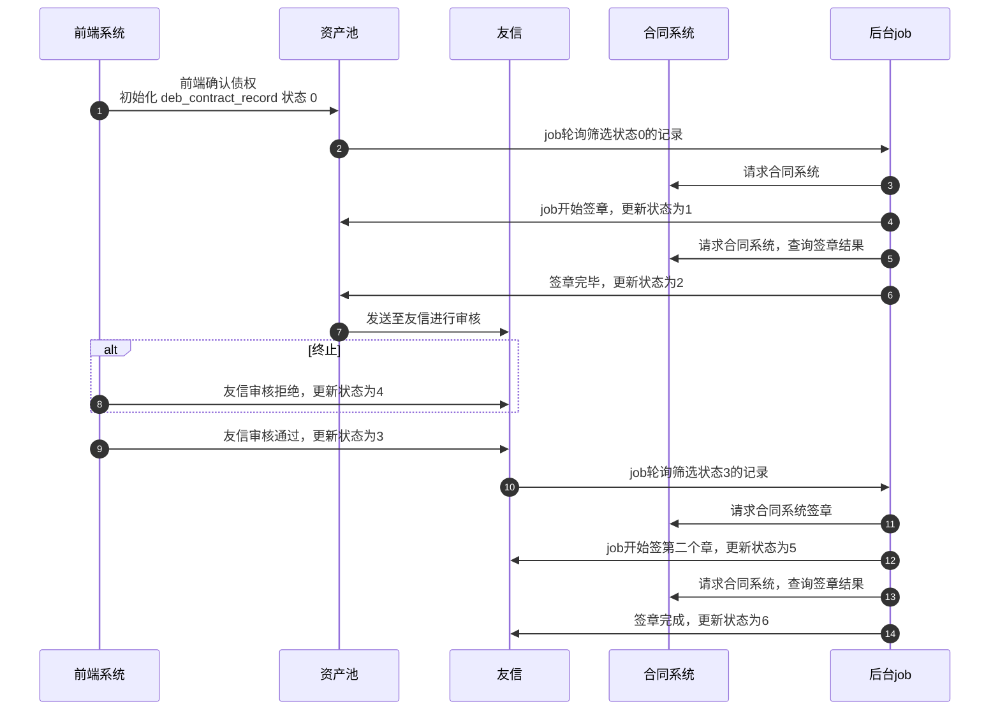

```mermaid
sequenceDiagram
	participant q as 前端系统
	participant z as 资产池
	participant y as 友信
%%	participant f as 富盈
	participant h as 合同系统
	participant j as 后台job
	autonumber
	q ->> z : 前端确认债权<br>初始化 deb_contract_record 状态 0
	z ->> j : job轮询筛选状态0的记录
	j ->> h : 请求合同系统
	j ->> z : job开始签章，更新状态为1
	j ->> h : 请求合同系统，查询签章结果
	j ->> z : 签章完毕，更新状态为2
	z ->> y : 发送至友信进行审核
	alt 终止
		q ->> y : 友信审核拒绝，更新状态为4
	end

	q ->> y : 友信审核通过，更新状态为3
	y ->> j : job轮询筛选状态3的记录
	j ->> h : 请求合同系统签章
	j ->> y : job开始签第二个章，更新状态为5
	j ->> h : 请求合同系统，查询签章结果
	j ->> y : 签章完成，更新状态为6
	
```